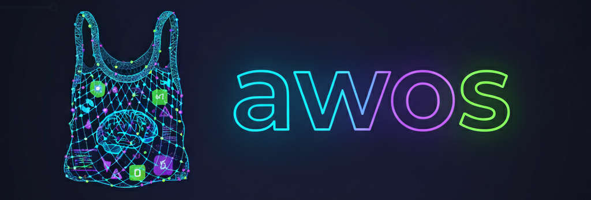

# **Agentic Workflow Operating System for Coding Assistance**

This framework outlines a structured approach to leveraging LLMs for high-quality code generation, moving beyond basic prompting to a spec-driven development methodology.

## 🚀 Quick Start: Your First Project with `awos`

Welcome to **`awos`**[^1]! This guide will walk you through building a new software product from idea to implementation using a series of simple commands.

### Before You Begin

To get started with **`awos`**, you'll need a couple of things set up first:

- **Node.js and npm**: You only need these to run the npx installer command and for future updates. The **`awos`** agents themselves do not require Node.js to operate once installed.

- **Claude Code**: This framework is designed and tested primarily for the Claude Code environment. While we've built it with other agentic systems in mind (and welcome contributions!), all examples assume you are using Claude Code.

**Important Note on Token Usage**: **`awos`** works by feeding large amounts of context from your project files to the AI. This can consume a significant number of tokens. Please plan your Claude subscription or AWS Bedrock usage accordingly to avoid unexpected costs/limits.

### Step 1: Install `awos`

First, open your terminal, create a new directory for your project, and run this single command. It will set up everything you need.

```sh
npx @provectusinc/awos
```

### Step 2: Follow the Workflow

**`awos`** guides you through a logical, step-by-step process. You'll use a series of "agents" to define, plan, and build your product. Run the commands in the following order.

1. `/awos:product`

- **What it does**: Creates the high-level Product Definition.
- **Think of it as**: Your project's main ID card. It answers the big questions: _What_ are we building, _why_, and for _who_?
- Audience: Product Owner (Non-Technical)

2. `/awos:roadmap`

- **What it does**: Creates the Product Roadmap.
- **Think of it as**: Your project's GPS. It lays out the features you will build and in what order.
- Audience: Product Manager (Non-Technical)

3. `/awos:architecture`

- **What it does**: Defines the System Architecture.
- **Think of it as**: Your project's building blueprint. It decides the technology stack, databases, infrastructure, etc.
- Audience: Solution Architect (Technical)

4. `/awos:spec`

- **What it does**: Creates a detailed Functional Specification for a single feature from the roadmap.
- **Think of it as**: A detailed plan for one room in your house. It describes exactly what the feature does for a user.
- Audience: Product Analyst (Non-Technical)

5. `/awos:tech`

- **What it does**: Creates the Technical Specification.
- **Think of it as**: The builder's instructions for that one room. It explains _how_ to build the feature.
- Audience: Tech Lead (Technical)

6. `/awos:tasks`

- **What it does**: Breaks the technical spec into a Task List.
- **Think of it as**: The step-by-step construction checklist for engineers to follow.
- Audience: Tech Lead (Technical)

7. `/awos:implement`

- **What it does**: Executes tasks (finally, actual code generation).
- **Think of it as**: The project foreman. This agent delegates the coding work to sub-agents and tracks progress.
- Audience: Team Lead (Technical)

### Step 3: You're Awesome

That's it! By following these steps, you can systematically turn your vision into a well-defined and fully implemented product.

## The `awos` Philosophy

The **`awos`** framework is built on a simple but powerful idea: AI agents, like human developers, need clear context to do great work. Without a structured plan, even the most advanced LLM can act like a confused intern. **`awos`** provides a step-by-step workflow that transforms your vision into a detailed blueprint that AI agents can understand and execute flawlessly. This process ensures the AI's incredible speed is channeled into building the right software, correctly, on the first try.

➡️ [Read more about the philosophy behind **`awos`**](docs/rationale.md)

## The `awos` Document Structure

The **`awos`** workflow is built on a clear document structure that creates a traceable path from a high-level idea to a single line of code. By storing the project's entire state in files like the **Product Definition**, **Roadmap**, and **Specifications**, the entire process becomes idempotent. This is a powerful feature: you can clear your chat history at any time, and an **`awos`** agent can instantly restore the full project context from this single source of truth. This ensures that both humans and AI agents always have exactly the context they need to build the right thing.

➡️ [Learn more about the purpose of each document](docs/document-structure.md)

## What's Included in `awos`?

**`awos`** is a complete framework for agentic software development. It consists of four key components that work together to turn your ideas into code:

- 🚀 **An Installer**: A simple `npx` command that instantly sets up a new project. It creates all the necessary directories, templates, and configuration files, so you can start defining your product in minutes.

- 🤖 **A Set of AI Agents**: A suite of interactive commands (like `/awos:product`, `/awos:roadmap`, and `/awos:implement`). Each command is a specialized agent with a sophisticated prompt that guides you through a specific stage of the development lifecycle, from product definition to task execution.

- 🛠️ **Pre-defined Sub-Agents**: A collection of specialized AI workers that the main agents delegate tasks to. This includes sub-agents for coding, testing, and other utility functions, ensuring that the right "AI expert" is used for every job.

- 🔌 **Extensibility Hooks**: An advanced system for customization. Hooks and other configuration points allow you to modify and extend the framework to fit your team's specific workflow and needs (more decisions on this is coming soon).

---

[^1]: The Russian word «авось» (a-VOHS’) doesn’t have a direct equivalent in English — it’s a very culturally loaded concept. It’s a mix of hope, chance, and fatalism, often with a sense of “let’s do it and maybe it will work out.”
